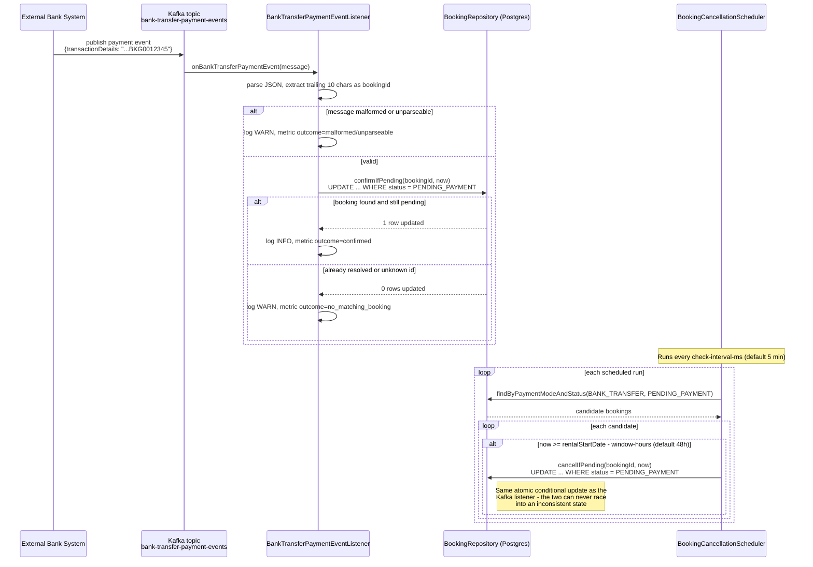

# Car Booking Service

A Spring Boot microservice for **Velocity Motors** that manages car rental bookings, built as part of a take-home assignment. It confirms bookings based on payment method (digital wallet/cash, credit card, or bank transfer), integrates with an external credit-card validation service, consumes bank-transfer payment events from Kafka, and automatically cancels unpaid bank-transfer bookings 48 hours before rental start.

> **Known gaps - things I still need to improve.** This project goes beyond what the assignment actually asked for in a lot of places, Here's what I know is missing or not done the right way, i want to addess this upfront.:
> 1. **No TLS/HTTPS anywhere.** Every request — including customer name and payment reference — goes over plain HTTP, both locally and in the Docker/Kubernetes setup. In a real deployment this would be handled at the ingress or by a service mesh, but this project doesn't do it at all right now.
> 2. **No authentication on this branch.** Right now anyone can call `/booking`, no login needed. I did build a JWT-based login on a separate branch (`feature/jwt-authentication`), but kept it out of this branch on purpose so the API stays easy to test/grade without needing a token first.
> 3. **Booking ID generation isn't safe with more than one pod running.** Each pod keeps its own counter in memory, starting from `repository.count()` when it boots. If two pods start around the same time and both get requests, they can end up generating the same booking ID — and the second insert fails since the ID is a primary key. This needs a real DB sequence or a shared ID generator, not a counter sitting inside each pod.
> 4. **Distributed tracing was attempted and abandoned.** A real OpenTelemetry + Tempo/Grafana integration was built and live-verified, then reverted after real friction (an OkHttp version conflict from the OTLP exporter, a Tempo bind-address misconfiguration, a missing Spring Boot `WebClient` auto-configuration module). Only correlation-ID log stitching and Micrometer metrics exist today — no real cross-service trace visibility, needed more time to investigate it.
> 5. **The credit-card-validation-service spec is read, not code-generated from.** The assignment says to integrate and use the OpenAPI file directly, but we only used it as a reference and wrote the client by hand. Tried generating it with openapi-generator twice (webclient and feign options), both failed because they generate old Jackson 2 code and this project runs on Jackson 3. So we hand-wrote the client to match the spec instead. To actually check the hand-written client matches the spec (not just eyeball it), I ran it through a real OpenAPI tool (`openapi4j`) in `CreditCardValidationServiceContractTest` — and that turned up a genuine bug in the given spec itself: the `status` field was written as `format: enum` with the APPROVED/REJECTED list indented under it, which isn't valid enum syntax, so the enum restriction the spec author clearly meant never actually applied. I fixed that in this project's copy of the spec (a real `enum:` key now), and went a step further: `client/openapi/CreditCardValidationContractValidator` checks every real request/response against this spec live, not just in a test. It's deliberately observability-only though — a mismatch is logged and counted (`credit_card_contract_check_total`), never thrown, so a schema technicality on the upstream's side can't hard-fail a real customer's booking; `CreditCardPaymentStrategy`'s own status check still decides the outcome, same as before.
> 6. **The Azure DevOps/AKS pipeline was never run for real.** I wrote a full build/test/SonarQube/security-scan/deploy pipeline with real placeholders for the container registry, SonarQube, AKS, and approvals, but I don't have a real Azure DevOps org or AKS cluster to actually run it against. So it's carefully written, not pipeline-tested - someone plugging in real infra might still hit something I couldn't see from here.

## Tech Stack

- **Java 21**, **Spring Boot 4.1.1** (Spring Framework 7 / Jackson 3)
- **Spring Web MVC** — REST API
- **Spring Data JPA** + **PostgreSQL** — persistence
- **Spring for Apache Kafka** — consumes `bank-transfer-payment-events`
- **Spring's `RestClient`** — calls the external credit-card-validation-service (synchronous by nature — this call was always blocking, so `RestClient` fits better than pulling in the reactive `WebClient`/WebFlux stack for one blocking call)
- **Spring Boot Actuator** — health, liveness, and readiness endpoints for Kubernetes
- **Spring Framework 7 native API versioning** — see API Versioning below
- **Lombok** — reduces entity boilerplate (including `@Slf4j` for every class that logs)
- **Maven** — build
- **Docker** — multi-stage build for deployment

## Architecture

```
controller/     BookingController              — REST endpoint
dto/            BookingRequest, BookingResponse, ErrorResponse
enums/          VehicleCategory, PaymentMode, BookingStatus
entity/         Booking (JPA)
repository/     BookingRepository               — atomic conditional updates, see below
service/        BookingService, VehicleValidationService, BookingIdGenerator
payment/        PaymentStrategy + one implementation per payment mode (Strategy pattern)
client/         CreditCardValidationClient (+ impl), client/dto/*, client/openapi/CreditCardValidationContractValidator
kafka/          KafkaConsumerConfig, BankTransferPaymentEvent, BankTransferPaymentEventListener
scheduler/      BookingCancellationScheduler
config/         ClockConfig, RestClientConfig, WebConfig (API versioning)
web/            CorrelationIdFilter               — MDC request-id tagging
logging/        MethodTraceLoggingAspect (AOP), MdcContext
exception/      GlobalExceptionHandler + one exception per failure case
```

**Payment-mode branching uses the Strategy pattern** (`payment/PaymentStrategy` + `DigitalWalletPaymentStrategy`, `CreditCardPaymentStrategy`, `BankTransferPaymentStrategy`), rather than an if/else chain in the service. `BookingService` resolves the correct strategy from a `Map<PaymentMode, PaymentStrategy>` built automatically from every `PaymentStrategy` bean Spring discovers — adding a new payment mode later means adding one class, not editing existing logic (open/closed principle).

### Async bank-transfer confirmation & auto-cancellation



## API

### `POST /booking`

**Request body:**
```json
{
  "customerName": "Shrikant",
  "vehicleId": "VEH12345",
  "rentalStartDate": "2026-09-20",
  "rentalEndDate": "2026-09-22",
  "vehicleCategory": "SUV",
  "paymentMode": "CASH",
  "paymentReference": ""
}
```
- `vehicleCategory`: `COMPACT` | `SEDAN` | `SUV` | `LUXURY`
- `paymentMode`: `CASH` | `DIGITAL_WALLET` | `CREDIT_CARD` | `BANK_TRANSFER`
- `paymentReference`: required only when `paymentMode = CREDIT_CARD` (see Assumptions)

**Response (`201 Created`):**
```json
{ "bookingId": "BKG0000001", "status": "CONFIRMED" }
```
`status` is one of `PENDING_PAYMENT` / `CONFIRMED` / `CANCELLED`.

**Validation & error responses** — every error returns `{ "message": "...", "timestamp": "..." }`:

| Condition | Status |
|---|---|
| Bean validation failure (blank/missing required field) | 400 |
| Vehicle ID fails validation | 400 |
| Rental period > 21 days, or end date not after start date | 400 |
| `paymentReference` missing for `CREDIT_CARD` | 400 |
| Bank transfer requested with rental start already inside the 48h cancellation window | 400 |
| Credit card validation returned `REJECTED` (or any non-`APPROVED` status) | 422 |
| credit-card-validation-service unreachable or returned an error | 502 |
| Unrecognized `X-API-Version` (see API Versioning below) | 400 |
| Anything unexpected | 500 |

### API Versioning

Uses Spring Framework 7's native API versioning support (`WebMvcConfigurer.configureApiVersioning`), not a hand-rolled URL-prefix or header scheme. Clients specify a version via the `X-API-Version` header; the current (and only) version is `1.0`, which is also the configured default — so omitting the header entirely (as every existing client and test does) still resolves correctly. This is purely additive groundwork: a `2.0` handler can be added to `BookingController` later without breaking whatever is still calling the `1.0` contract.

```bash
curl -X POST http://localhost:8082/booking -H "X-API-Version: 1.0" -H "Content-Type: application/json" -d '{...}'
```

An unrecognized version (e.g. `X-API-Version: 2.0`, which doesn't exist yet) returns a clean `400` with a clear message, rather than a generic `500` — handled by a dedicated `ResponseStatusException` mapping in `GlobalExceptionHandler`, since Spring's own `InvalidApiVersionException` already carries the correct status and just needs to not be swallowed by the catch-all handler.

### Payment flows

- **Cash / Digital Wallet** → booking confirmed immediately, no external call.
- **Credit Card** → `paymentReference` is sent to `credit-card-validation-service` (`POST /payment-status`, per the given OpenAPI spec). `APPROVED` confirms the booking; anything else raises `PaymentDeclinedException` (422). Nothing is persisted on rejection.
- **Bank Transfer** → booking is created as `PENDING_PAYMENT` (unless the rental start is already inside the 48h cancellation window — rejected upfront instead, see Assumptions). Confirmation happens later via the Kafka consumer described below.

### Event-driven confirmation (`bank-transfer-payment-events`)

The service consumes JSON messages shaped:
```json
{"paymentId":"PAY001","senderAccountNumber":"ACC123456","paymentAmount":500.00,"transactionDetails":"TXN987654321 BKG0012345"}
```
`transactionDetails` packs a 12-character transaction reference and a 10-character Booking ID together. The listener extracts the **trailing 10 characters** of the (trimmed) string as the Booking ID — robust to extra whitespace between the two fields — and atomically confirms that booking if (and only if) it's still `PENDING_PAYMENT`. Unknown/already-resolved booking IDs are logged and skipped, not treated as errors (this also handles duplicate/replayed messages safely).

**Error handling & dead-lettering.** The listener container factory (`KafkaConsumerConfig`) wraps every message in a `DefaultErrorHandler` backed by a `DeadLetterPublishingRecoverer`: if the listener throws, the message is retried up to 3 times (1s apart) before being republished to `bank-transfer-payment-events-dlt` (Spring Kafka's default `<topic>-dlt` naming) so one bad message can't wedge the partition. That said, two failure modes are **not** transient — unparseable JSON and a `transactionDetails` too short to carry a booking ID — retrying the same malformed message 3 times would fail identically every time. Both now throw `MalformedBankTransferEventException`, which is registered via `errorHandler.addNotRetryableExceptions(...)` so it skips the retry backoff entirely and lands on the dead-letter topic immediately, verified in `BankTransferKafkaIntegrationTest` (the message arrives on `-dlt` in well under the 3 seconds a retried failure would take). Earlier this exception type didn't exist — both cases were just logged and silently dropped, with no way to recover or replay a bad message once the log line scrolled away.

### Automatic cancellation

A scheduled job (`BookingCancellationScheduler`, interval configurable) checks every `PENDING_PAYMENT` bank-transfer booking and cancels it once the current time reaches `rentalStartDate` (at midnight) minus the configured cancellation window (default 48h). Cancellation uses the same atomic-conditional-update mechanism as Kafka confirmation, so the two can never race into an inconsistent state (see Assumptions).

## Health Checks (`/actuator/*`)

- `GET /actuator/health` — overall status, aggregating every registered health indicator (DB, Kafka, disk space, etc.)
- `GET /actuator/health/liveness` — **process-health only**, no external dependency checks. Wired to a Kubernetes `livenessProbe`. Kept deliberately minimal: liveness failures cause Kubernetes to *restart* the pod, and restarting a healthy process won't fix a downed database or broker — mixing dependency checks into liveness just causes pointless restart churn during an outage.
- `GET /actuator/health/readiness` — includes the app's own readiness state **plus the database check**, but *not* Kafka. Readiness failures pull the pod out of the Service's load-balancer rotation. A downed database means the app genuinely can't serve any request, so that should fail readiness. A downed Kafka broker only affects the asynchronous bank-transfer confirmation path — `POST /booking` for `CASH`/`DIGITAL_WALLET`/`CREDIT_CARD` still works fine — so it deliberately isn't wired into readiness, to avoid taking a still-mostly-functional pod out of rotation.

## Observability (Prometheus)

- `GET /actuator/prometheus` — Prometheus-format scrape endpoint (`management.endpoints.web.exposure.include` includes `prometheus`). Exposes Micrometer's usual auto-instrumented metrics (JVM memory/GC/threads, `http_server_requests` with percentile histograms enabled, HikariCP connection-pool stats, Kafka consumer/producer client metrics, disk space, etc.) plus five custom business counters registered via an injected `MeterRegistry`:

  | Metric | Tags | Incremented when |
  |---|---|---|
  | `bookings_total` | `paymentMode`, `status` | Every booking is persisted (`BookingService`) |
  | `bookings_autocancelled_total` | — | The 48h scheduler cancels a `PENDING_PAYMENT` bank-transfer booking |
  | `credit_card_validation_calls_total` | `outcome` (`success`/`error`) | Every call to the external credit-card-validation-service, regardless of APPROVED/REJECTED |
  | `credit_card_payment_result_total` | `result` (`approved`/`declined`) | A credit-card validation response is interpreted into a booking outcome |
  | `bank_transfer_events_total` | `outcome` (`confirmed`/`no_matching_booking`/`malformed`/`unparseable`) | Every Kafka `bank-transfer-payment-events` message is processed |

  Every metric also carries an `application=car-booking-service` tag (`management.metrics.tags.application`), so multiple services can share one Prometheus/Grafana instance without name collisions.

  Assumptions we are using Kubernetes
- In Kubernetes, the pod template in [`k8s/deployment.yaml`](k8s/deployment.yaml) carries `prometheus.io/scrape`, `prometheus.io/port`, and `prometheus.io/path` annotations for annotation-based Prometheus service discovery.

## Resilience (Retry & Circuit Breaker)

The only synchronous external HTTP dependency in the booking path is the credit-card-validation-service call in [`CreditCardValidationClientImpl`](src/main/java/com/velocitymotors/carbooking/client/CreditCardValidationClientImpl.java). It's wrapped with Resilience4j (`resilience4j-spring-boot4`), configured under `resilience4j.retry.instances.creditCardValidation` / `resilience4j.circuitbreaker.instances.creditCardValidation` in `application.yaml`:

- **Retry** (max 3 attempts, 300ms wait) - kept deliberately small. For `CREDIT_CARD` bookings this call happens *inside* an open DB transaction while holding the vehicle/payment-reference advisory lock (see decision below), so every retry attempt directly extends how long that lock is held - a generous retry policy would turn a slow upstream into DB lock contention.
- **Circuit breaker** (count-based, window of 10, opens at ≥50% failure rate over ≥5 calls, 30s open state) - once the upstream is clearly unhealthy, further calls fail immediately (`CallNotPermittedException`, mapped to the same 502 as any other unavailability) instead of piling up threads waiting on a struggling dependency.
- **A transient failure (network error, upstream 5xx) is treated differently from a definitive one (upstream 4xx)** via `CreditCardTransientFailurePredicate`: a 4xx fails on the first attempt (retrying the same bad request changes nothing) and doesn't count against the circuit breaker's failure rate (a bad request on our side, or a genuine "payment not found," isn't evidence the upstream itself is unhealthy). Only network failures and 5xx responses are retried and count as circuit-breaker failures.
- Retry and circuit-breaker state is visible at `GET /actuator/circuitbreakers` and as Prometheus metrics (`resilience4j_circuitbreaker_*`, `resilience4j_retry_*`) - both verified live: a real run against an unreachable upstream showed exactly 3 attempts ~300ms apart, the circuit opening after 5 buffered failures, and the next call failing in ~76ms instead of the usual ~600-900ms.
- **Decorator order matters**: retry wraps the circuit breaker (not the reverse), so once the breaker opens partway through a retry sequence, the remaining attempts in that sequence fail fast instead of still hitting the network - the standard Resilience4j composition for this scenario.

## Database Migrations (Flyway)

Schema is owned by Flyway, not Hibernate. `spring.jpa.hibernate.ddl-auto` is `validate` - on startup, Hibernate checks its entity mappings against whatever Flyway has already created and fails fast on drift, instead of silently auto-altering the schema the way `ddl-auto: update` did before.

- Migrations live in [`src/main/resources/db/migration`](src/main/resources/db/migration); `V1__create_bookings_table.sql` creates the `bookings` table plus three indexes matching the repository's actual query patterns (`vehicle_id, status` for the double-booking check, `payment_reference, status` for the payment-reference-reuse check, `payment_mode, status` for the cancellation scheduler's lookup) - none of these existed under Hibernate's auto-DDL, since it never generates indexes beyond the primary key.
- The `Booking` entity now carries explicit `@Column(nullable = false, length = ...)` annotations matching the migration, tightening constraints Hibernate's auto-DDL never actually enforced (every field but `paymentReference` is genuinely required).
- Local dev/Testcontainers Postgres instances start empty, so migrations always run from `V1` on a fresh database - no separate baseline step needed for this project.

## Docker & Kubernetes

Build and run the container directly:
```bash
docker build -t car-booking-service:latest .
docker run -p 8082:8082 car-booking-service:latest
```
The `Dockerfile` is a multi-stage build (JDK 21 to compile, JRE 21 to run) so the resulting image doesn't carry a full JDK or the Maven build cache, and runs as a non-root user.

**Important when containerized or deployed to Kubernetes:** `KAFKA_BOOTSTRAP_SERVERS` and `CREDIT_CARD_SERVICE_BASE_URL` both default to `localhost:...`, which only resolves correctly for a non-containerized local run — inside a container, `localhost` refers to the container itself, not the host or a sibling service. Override both env vars to point at the real Kafka broker and credit-card service addresses in your environment.

Example manifests are in [`k8s/`](k8s/) (`deployment.yaml`, `service.yaml`, `secret-example.yaml`), wiring the liveness/readiness endpoints above into real Kubernetes probes. Since state lives in PostgreSQL rather than in-process, the deployment runs `replicas: 2` to demonstrate real horizontal scaling.

### Secrets in a real deployment

`k8s/secret-example.yaml` is illustrative only (`"REPLACE_ME"`) — a plain Kubernetes Secret is just base64-encoded, not encrypted at rest by default, and isn't a real secret *store* (no rotation, no access audit trail, no central policy). The app already does the part that's actually its job correctly: every credential (`DB_PASSWORD`) arrives as an environment variable, never hardcoded or baked into the image or a config file — `application.yaml` only ever sees `${DB_PASSWORD:car_booking}`, a placeholder with a local-dev fallback.

What feeds that env var in a real cloud deployment would be a managed secret store — **Azure Key Vault**, **AWS Secrets Manager**, or **GCP Secret Manager** — not a checked-in YAML file. The usual bridge into Kubernetes is one of:
- A **CSI Secret Store driver** (e.g., the Azure Key Vault Provider for Secrets Store CSI Driver, or AWS's equivalent) mounting the vault's secrets as files or projecting them as env vars directly into the pod, with no plain Kubernetes Secret object in between at all.
- The **External Secrets Operator**, which syncs a value from the cloud vault into a native Kubernetes Secret on a schedule — the app still reads a normal `secretKeyRef` env var (no code change needed), but the source of truth is the cloud vault, and rotation there propagates automatically.

Either way, the application code and `secretKeyRef` wiring in `deployment.yaml` stay exactly as they are — only *where the secret's value ultimately comes from* changes, which is why this is documented as the intended production target rather than implemented here (no real cloud vault to point at in this environment).

## CI/CD Pipeline (Azure DevOps + AKS)

A single-environment (production) pipeline lives at [`azure-pipelines.yml`](azure-pipelines.yml): build → test (real Postgres/Kafka via Testcontainers) → SonarQube quality gate → security scans (OWASP dependency check, secret scanning, a SAST placeholder) → build & Trivy-scan the Docker image → push image to a container registry, package the Helm chart → **manual approval** → deploy → smoke test. Kept to one environment deliberately — a dev/uat/prod promotion chain is real-world standard for a multi-team org, but more pipeline than a single-service take-home assignment needs; the point here is showing the pieces that belong in a real pipeline, not simulating an org that doesn't exist. The registry is shown as Azure Container Registry (the natural default alongside AKS) — JFrog Artifactory, ECR, or GCR would look almost identical, it's just a service connection swap.

**Rollback is permission-gated and failure-triggered, never automatic or silent**: a healthy deployment finishes and nothing further happens. Only if the deployment or its smoke test actually fails does the pipeline ask a human to approve a rollback — see [`pipelines/templates/deploy-and-rollback.yml`](pipelines/templates/deploy-and-rollback.yml) for exactly how that gating works (Azure DevOps stage conditions, not a manual runbook step).

Deployment itself moved from the plain manifests in `k8s/` to a proper **Helm chart** at [`helm/car-booking-service/`](helm/car-booking-service/). The `k8s/` manifests are left in place as the simpler, single-file reference for a quick manual `kubectl apply`.

Worth flagging directly to whoever's reviewing this: real organizations don't usually keep pipeline templates like the SonarQube/security-scan/Docker ones under `pipelines/templates/` copy-pasted into every service's own repo — they live once in a shared, versioned "pipeline-templates" repository that every project's pipeline references by URL (`resources.repositories` + `- template: x.yml@templates` in Azure DevOps). That's spelled out with a real example at the top of `azure-pipelines.yml`; it's kept as local files here only because this is a single-repo assignment with no separate template repo to actually point at.

Every piece of real infrastructure the pipeline needs — service connections, the AKS cluster name, the registry/SonarQube details, secrets — is a clearly marked `REPLACE_ME` placeholder; see [`pipelines/README.md`](pipelines/README.md) for the full setup checklist. Stated plainly, matching the gaps called out at the top of this file: **this pipeline has never run against real Azure DevOps/AKS/SonarQube infrastructure** (none of that exists in this environment) — it's written carefully and consistently, but "complete" here means "ready to point at real infrastructure," not "pipeline-tested."

## Assumptions & Design Decisions

The assignment states *"all details provided are sufficient; you may make additional logical assumptions when needed."* The brief itself contains some internal gaps/inconsistencies; here's every non-obvious decision made to resolve them, and why:

1. **`CASH` and `DIGITAL_WALLET` are both treated as instant-confirm.** The Functional Requirements section says "digital wallet"; the Request Data section's payment-mode list says "Cash" instead, with no logic given for Cash at all. Both enum values exist and share one `DigitalWalletPaymentStrategy`.
2. **`credit-card-validation-service` is external — I only integrate a client, not the service.** The given OpenAPI YAML documents a contract I call, not something I implement.
3. **I tried generating the client code automatically using the OpenAPI Maven plugin to follow the requirement to "integrate and use" the spec file. However, during a test build, I found that the plugin (v7.10.0) automatically forces Jackson 2 imports (com.fasterxml.jackson.*). Because our project uses Spring Boot 4.1.1, it runs on Jackson 3 (tools.jackson.*). I need more time to investigate it issue. 
4. **Booking IDs are exactly 10 characters** (`"BKG"` + 7-digit zero-padded sequence, e.g. `BKG0012345`), matching the shape embedded in `transactionDetails`. This is the only correlation key the Kafka event carries back to a specific booking — if the ID format ever drifted from 10 characters, bank-transfer confirmations would silently stop matching, and paid bookings would be auto-cancelled anyway.
5. **`paymentReference` is functionally required only for `CREDIT_CARD`.** For bank transfer, correlation happens via the Booking ID embedded in the Kafka event, not via this field — so it's optional/unused for other payment modes.
6. **No pricing/amount schema is given anywhere in the assignment** (no per-category rate, no total-cost field). Any bank-transfer-payment-event that resolves to a given `PENDING_PAYMENT` booking is treated as full payment received — partial-payment accumulation isn't attempted since there's no defined total to compare against.
7. **`rentalStartDate`/`rentalEndDate` are dates with no time component.** The 48-hour cancellation deadline is computed as `rentalStartDate.atStartOfDay().minusHours(48)`.
8. **Bank-transfer bookings are rejected upfront (400) if the rental start is already inside the 48-hour window at creation time**, rather than being accepted as `PENDING_PAYMENT` only to be auto-cancelled moments later. Nothing in the brief asks for this explicitly, but accepting a booking that's already guaranteed to be cancelled is misleading to the customer and contradicts the spirit of the rule.
9. **Race safety**: the Kafka listener and the cancellation scheduler both transition booking status independently, on different threads. Both use an atomic, conditional SQL `UPDATE ... WHERE status = 'PENDING_PAYMENT'` (`confirmIfPending` / `cancelIfPending`), never a read-then-save — this guarantees a booking can't be confirmed and cancelled out of order regardless of timing.
10. **Vehicle ID validation is mocked**, per the assignment's own suggestion ("mock or assume validation logic") — a simple pattern check (`^[A-Z0-9]{5,10}$`), swappable later for a real vehicle-service call.
11. **The credit-card-validation-service's sample server URL in the given YAML is malformed** (`http//:localhost:9090//host/credit-card-payment-api`). A corrected, sane default is used, configurable via `credit-card-validation-service.base-url`.
12. **Kafka message consumption uses plain For Kafka message consumption, I used a plain String with manual JSON parsing via ObjectMapper, rather than a typed JsonDeserializer. In Spring Kafka 4.0, the standard JsonDeserializer is deprecated for removal in favor of a new Jackson 3 replacement. Because the new API's stability wasn't fully clear yet, sticking to a String-based approach let me rely on stable, well-understood APIs. This also gives us explicit, centralized control over how we handle malformed or corrupted messages.If i would have schema registry, i would have thinked toward to use JsonDeserializer. 
13. **Avro + Schema Registry were deliberately not used** for the Kafka event, even though this is a payments-adjacent scenario where that's common in real systems. The assignment gives a plain descriptive JSON structure (not a schema file, unlike the OpenAPI spec it did provide for the other integration) and no schema registry endpoint — introducing one would be unrequested infrastructure the grader can't run.
14. **An additional Testcontainers-based Kafka integration test exists** (`BankTransferKafkaTestcontainersTest`), tagged and excluded from the default build so it doesn't add to the Docker dependency below beyond what's already required — it verifies the same scenario against a real Kafka broker instead of the embedded one.
15. **The service uses PostgreSQL (via Testcontainers) for every `@SpringBootTest`, not H2.** This was a deliberate choice for full test/production parity over the alternative (H2 for speed, real Postgres only in production). The consequence, stated plainly: the *entire* test suite now requires Docker to run, not just the opt-in Testcontainers Kafka test — `mvn clean verify` will fail without Docker available. If building in a Docker-less environment, `mvn clean package -DskipTests` still compiles and packages the application; running the real test suite requires Docker to be running, same as `docker compose up` already does for the local Kafka/Postgres dev setup.
16. **API versioning uses a header (`X-API-Version`), not a URL path prefix (`/v1/booking`).** Nothing in the assignment asks for versioning at all — this is added as a production-readiness demonstration. A header keeps the URL stable across versions and doesn't disturb the existing `/booking` path any of the 42 tests or the assignment's own examples reference; a path-based scheme would have meant renaming the endpoint everywhere for no functional benefit. The default version (`1.0`) means this is purely additive — no existing caller needs to change anything.
17. **`POST /booking` is intentionally left unauthenticated on this branch.** In a real deployment, this service would sit behind an API gateway and/or validate a JWT issued by a separate, dedicated Identity Provider — it would never authenticate users or issue tokens itself (see Tech Stack: this service already receives caller-identifying data like customer name and payment mode, implying whoever calls it has already gone through a login step elsewhere). That's assumed rather than implemented here so the service stays directly testable without requiring a token on every request — auth wasn't asked for by the assignment either. A full working demonstration of what that would look like (self-issued JWT, `/auth/login`, protected `/booking`, full test coverage) lives on the `feature/jwt-authentication` branch, kept separate rather than merged so `master`/`main` stays simple to run and grade.

## Running Locally

**Prerequisites:** JDK 21, Maven (or use the included `./mvnw`), Docker (for PostgreSQL and Kafka).

```bash
docker compose up -d
./mvnw spring-boot:run
```
The app starts on **port 8082** (`server.port` in `application.yaml`) against the PostgreSQL instance started by `docker-compose.yml`. Both PostgreSQL and Kafka connection settings are fully overridable via environment variables — see Configuration Reference below.

### Running Kafka locally (to exercise the bank-transfer flow)

`docker compose up -d` (above) already starts both PostgreSQL and a single-node Kafka broker (KRaft mode, no Zookeeper container needed) on `localhost:9092`. Create the Kafka topic once if it doesn't already exist:
```bash
docker exec car-booking-kafka /opt/kafka/bin/kafka-topics.sh --create --topic bank-transfer-payment-events --bootstrap-server localhost:9092 --partitions 1 --replication-factor 1 --if-not-exists
```
Then publish a test event (replace `BKG0000001` with a real booking ID returned from a prior `POST /booking` call):
```bash
docker exec -it car-booking-kafka /opt/kafka/bin/kafka-console-producer.sh --bootstrap-server localhost:9092 --topic bank-transfer-payment-events
```
```json
{"paymentId":"PAY001","senderAccountNumber":"ACC123456","paymentAmount":500.00,"transactionDetails":"TXN987654321 BKG0000001"}
```

**Troubleshooting: `password authentication failed for user "car_booking"` on local run.** If you have PostgreSQL already installed and running natively on your machine (outside Docker), it's likely already bound to the default port 5432. `docker-compose.yml` deliberately maps this project's Postgres container to host port **5433** (not 5432) for exactly this reason, matched by `application.yaml`'s `DB_PORT` default — but if you've overridden `DB_PORT` back to `5432` for any reason and see this error, that's almost certainly a collision with a pre-existing local Postgres instance, not a real credentials problem. Confirm with `Get-Process -Name postgres` (Windows) or `lsof -i :5432` (macOS/Linux) before assuming the container's config is wrong.

## Testing

```bash
mvn clean verify
```
**Requires Docker to be running** — every `@SpringBootTest` in this suite uses a real PostgreSQL instance via Testcontainers (see Assumptions #15). Covers:

- **Unit** (no Spring context, no Docker): `BookingIdGeneratorTest`, `DigitalWalletPaymentStrategyTest`, `BankTransferPaymentStrategyTest`, `CreditCardPaymentStrategyTest`, `BookingServiceTest`, `BankTransferPaymentEventListenerTest`, `BookingCancellationSchedulerTest` (deterministic 48h-boundary testing via an injectable `Clock` — no real-time waiting needed)
- **HTTP layer** (no Docker): `BookingControllerTest` (MockMvc, service mocked — success path, Bean Validation wiring, and every exception→status mapping through `GlobalExceptionHandler`)
- **External client** (no Docker): `CreditCardValidationClientImplTest` (OkHttp `MockWebServer` — verifies every response shape the OpenAPI spec documents)
- **True end-to-end** (`@SpringBootTest`, `WebEnvironment.RANDOM_PORT`, real `TestRestTemplate` calls over a real embedded server, real PostgreSQL via Testcontainers — no mocks anywhere in the request path except the external credit-card service):
  - `BookingCreationIntegrationTest` — all four payment-mode outcomes via a real `POST /booking`, each verified against the real database row it produced, plus a full round trip where a booking created via the real endpoint is then confirmed by a real Kafka event
  - `BookingSchedulerIntegrationTest` — a booking created via the real endpoint, then auto-cancelled by the real `BookingCancellationScheduler` bean (time is fast-forwarded via an isolated, per-test controllable `Clock` rather than waiting real hours)
- **Kafka integration**: `BankTransferKafkaIntegrationTest` (`@EmbeddedKafka` — full Spring context, real JSON over an in-process broker, real PostgreSQL write)

All `@SpringBootTest` classes share one PostgreSQL Testcontainer (via `AbstractPostgresIntegrationTest`, Testcontainers' singleton-container pattern) — started once per test run, not once per test class.

**Optional — Testcontainers-based Kafka integration test** (`BankTransferKafkaTestcontainersTest`), which runs the same Kafka scenario against a real broker in Docker instead of the embedded one. Excluded from the default build; run explicitly:
```bash
mvn test -Dtest=BankTransferKafkaTestcontainersTest -Dexcluded.test.groups=
```

## Configuration Reference (`application.yaml`)

| Property | Meaning | Default |
|---|---|---|
| `server.port` | HTTP port | `8082` |
| `spring.datasource.url` | PostgreSQL connection | built from `DB_HOST` (`127.0.0.1`), `DB_PORT` (`5433` — deliberately not 5432, see Troubleshooting below), `DB_NAME` (`car_booking`) |
| `X-API-Version` (request header, not an `application.yaml` property) | API version selector | `1.0` (also the default if omitted) — see API Versioning above |
| `spring.datasource.username` / `.password` | PostgreSQL credentials | env override: `DB_USERNAME` / `DB_PASSWORD` (both default to `car_booking`, matching `docker-compose.yml`) |
| `spring.kafka.bootstrap-servers` | Kafka broker address | `localhost:9092` (env override: `KAFKA_BOOTSTRAP_SERVERS`) |
| `app.kafka.topics.bank-transfer-payment-events` | Topic name | `bank-transfer-payment-events` |
| `app.booking.cancellation.check-interval-ms` | How often the cancellation scheduler runs | `300000` (5 min) |
| `app.booking.cancellation.window-hours` | Cancellation/rejection deadline before rental start | `48` |
| `credit-card-validation-service.base-url` | Base URL for the external validation service | `http://localhost:9090/host/credit-card-payment-api` (env override: `CREDIT_CARD_SERVICE_BASE_URL`) |
| `management.endpoint.health.group.readiness.include` | Indicators contributing to the readiness probe | `readinessState,db` (Kafka deliberately excluded — see Health Checks) |
| `spring.jpa.hibernate.ddl-auto` | Schema management mode | `validate` — Flyway owns the schema, Hibernate only checks its mappings match (see Database Migrations) |
| `spring.flyway.locations` | Where Flyway looks for migration scripts | `classpath:db/migration` (the default — set explicitly for documentation) |
