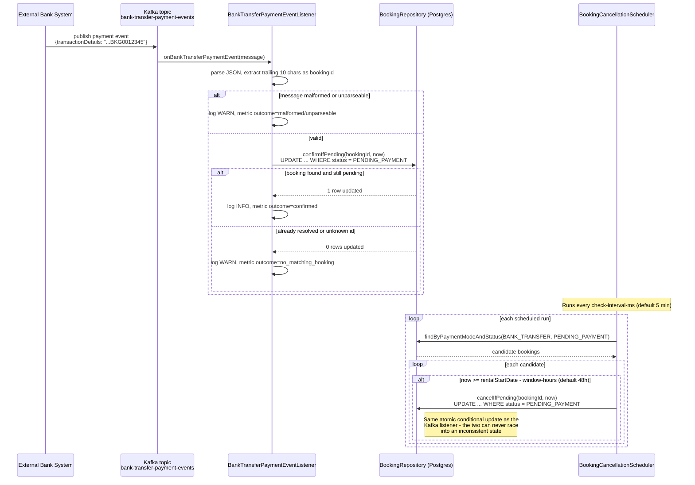

# Car Booking Service

A Spring Boot microservice I built for **Velocity Motors** as a take-home assignment. It manages car rental bookings: confirms them based on payment method (digital wallet/cash, credit card, or bank transfer), talks to an external credit-card validation service, listens for bank-transfer payment events on Kafka, and auto-cancels unpaid bank-transfer bookings 48 hours before the rental starts.

> **Known gaps - things I still need to improve.** This project goes beyond what the assignment actually asked for in a lot of places, Here's what I know is missing or not done the right way, i want to addess this upfront.:
> 1. **No TLS/HTTPS anywhere.** Every request — including customer name and payment reference — goes over plain HTTP, both locally and in the Docker/Kubernetes setup. In a real deployment this would be handled at the ingress or by a service mesh, but this project doesn't do it at all right now.
> 2. **No authentication on this branch.** Right now anyone can call `/booking`, no login needed. I did build a JWT-based login on a separate branch (`feature/jwt-authentication`), but kept it out of this branch on purpose so the API stays easy to test/grade without needing a token first.
> 3. **Distributed tracing was attempted and abandoned.** I built a real OpenTelemetry + Tempo/Grafana setup and got it working, then removed it after running into real problems (an OkHttp version clash from the OTLP exporter, a wrong Tempo bind address, a missing Spring Boot `WebClient` auto-config module). Only correlation-ID log tagging and Micrometer metrics exist today - no real cross-service trace view. I need more time to sort this one out.
> 4. **The credit-card-validation-service spec is read, not code-generated from.** The assignment says to integrate and use the OpenAPI file directly, but I only used it as a reference and wrote the client by hand. I tried generating it with openapi-generator twice (webclient and feign options), both failed because they generate old Jackson 2 code and this project runs on Jackson 3. So I hand-wrote the client to match the spec instead. To actually check the hand-written client matches the spec (not just eyeball it), I ran it through a real OpenAPI tool (`openapi4j`) in `CreditCardValidationServiceContractTest` — and that found a real bug in the given spec: the `status` field was written as `format: enum` with the APPROVED/REJECTED list indented under it, which isn't valid enum syntax, so the enum restriction never actually worked. I fixed that in this project's copy of the spec (a real `enum:` key now), and added `client/openapi/CreditCardValidationContractValidator`, which checks every real request/response against the spec live, not just in a test. It only logs and counts a mismatch though (`credit_card_contract_check_total`), never throws - `CreditCardPaymentStrategy`'s own status check still decides if a booking goes through, same as before.
> 5. **The Azure DevOps/AKS pipeline was never run for real.** I wrote a full build/test/SonarQube/security-scan/deploy pipeline with real placeholders for the container registry, SonarQube, AKS, and approvals, but I don't have a real Azure DevOps org or AKS cluster to actually run it against. So it's carefully written, not pipeline-tested - someone plugging in real infra might still hit something I couldn't see from here.

## Tech Stack

- **Java 21**, **Spring Boot 4.1.1** (Spring Framework 7 / Jackson 3)
- **Spring Web MVC** — REST API
- **Spring Data JPA** + **PostgreSQL** — persistence
- **Spring for Apache Kafka** — consumes `bank-transfer-payment-events`
- **Spring's `RestClient`** — calls the external credit-card-validation-service. This call is blocking anyway, so `RestClient` made more sense than pulling in the reactive WebFlux stack for one blocking call
- **Spring Boot Actuator** — health, liveness, and readiness endpoints for Kubernetes
- **Spring Framework 7 native API versioning** — see API Versioning below
- **Lombok** — cuts down entity boilerplate (including `@Slf4j` for every class that logs)
- **Maven** — build
- **Docker** — multi-stage build for deployment

## Architecture

```
controller/     BookingController              — REST endpoint
dto/            BookingRequest, BookingResponse, ErrorResponse
enums/          VehicleCategory, PaymentMode, BookingStatus
entity/         Booking, IdempotencyKey (JPA)
repository/     BookingRepository, IdempotencyKeyRepository — atomic conditional updates, see below
service/        BookingService, VehicleValidationService, BookingIdGenerator
payment/        PaymentStrategy + one implementation per payment mode (Strategy pattern)
client/         CreditCardValidationClient (+ impl), client/dto/*, client/openapi/CreditCardValidationContractValidator
kafka/          KafkaConsumerConfig, BankTransferPaymentEvent, BankTransferPaymentEventListener
scheduler/      BookingCancellationScheduler
config/         ClockConfig, RestClientConfig, WebConfig (API versioning)
web/            CorrelationIdFilter               — MDC request-id tagging
logging/        MethodTraceLoggingAspect (AOP), MdcContext
exception/      GlobalExceptionHandler + one exception per failure case
```

**Payment-mode branching uses the Strategy pattern** (`payment/PaymentStrategy` + `DigitalWalletPaymentStrategy`, `CreditCardPaymentStrategy`, `BankTransferPaymentStrategy`) instead of an if/else chain in the service. `BookingService` builds a `Map<PaymentMode, PaymentStrategy>` from every `PaymentStrategy` bean Spring finds, so adding a new payment mode later just means adding one class - no existing code needs to change.

### Async bank-transfer confirmation & auto-cancellation



## API

### `POST /booking`

**Request body:**
```json
{
  "customerName": "Shrikant",
  "vehicleId": "VEH12345",
  "rentalStartDate": "2026-09-20",
  "rentalEndDate": "2026-09-22",
  "vehicleCategory": "SUV",
  "paymentMode": "CASH",
  "paymentReference": ""
}
```
- `vehicleCategory`: `COMPACT` | `SEDAN` | `SUV` | `LUXURY`
- `paymentMode`: `CASH` | `DIGITAL_WALLET` | `CREDIT_CARD` | `BANK_TRANSFER`
- `paymentReference`: required only when `paymentMode = CREDIT_CARD` (see Assumptions)

**Required header: `Idempotency-Key`.** Send any unique string per booking attempt (a UUID is fine) - a request without this header is rejected with a `400`. A retried request with the same key returns the exact same response instead of creating a second booking or, for `CREDIT_CARD`, calling the validation service a second time. See Assumptions for why it's mandatory rather than optional, and how it's implemented.
```bash
curl -X POST http://localhost:8082/booking -H "Idempotency-Key: 3f2a1b4c-..." -H "Content-Type: application/json" -d '{...}'
```

**Response (`201 Created`):**
```json
{ "bookingId": "BKG0000001", "status": "CONFIRMED" }
```
`status` is one of `PENDING_PAYMENT` / `CONFIRMED` / `CANCELLED`.

**Validation & error responses** — every error returns `{ "message": "...", "timestamp": "..." }`:

| Condition | Status |
|---|---|
| Bean validation failure (blank/missing required field) | 400 |
| Vehicle ID fails validation | 400 |
| Rental period > 21 days, or end date not after start date | 400 |
| `paymentReference` missing for `CREDIT_CARD` | 400 |
| Bank transfer requested with rental start already inside the 48h cancellation window | 400 |
| Credit card validation returned `REJECTED` (or any non-`APPROVED` status) | 422 |
| credit-card-validation-service unreachable or returned an error | 502 |
| Unrecognized `X-API-Version` (see API Versioning below) | 400 |
| Missing `Idempotency-Key` header | 400 |
| Anything unexpected | 500 |

### `GET /booking/{id}`

The only way to check a booking's status after the fact - matters most for `BANK_TRANSFER`, which confirms asynchronously via Kafka sometime after the original `POST` response, so this is the only way a caller finds out it actually happened. No `Idempotency-Key` needed here - a `GET` has no side effect to deduplicate.

```bash
curl http://localhost:8082/booking/BKG6700417
```
**Response (`200 OK`):** same shape as the `POST` response above. **`404 Not Found`** if no booking exists with that id.

### API Versioning

This uses Spring Framework 7's built-in API versioning (`WebMvcConfigurer.configureApiVersioning`), not something hand-rolled. Clients send a version in the `X-API-Version` header. Right now there's only one version, `1.0`, and it's also the default - so leaving the header out (which every client and test currently does) still works fine. The point is just future-proofing: a `2.0` handler can be added to `BookingController` later without breaking anyone still calling `1.0`.

```bash
curl -X POST http://localhost:8082/booking -H "X-API-Version: 1.0" -H "Idempotency-Key: 3f2a1b4c-..." -H "Content-Type: application/json" -d '{...}'
```

Sending an unrecognized version (e.g. `X-API-Version: 2.0`, which doesn't exist yet) returns a clean `400` with a clear message instead of a generic `500`. Spring's own `InvalidApiVersionException` already carries the right status - `GlobalExceptionHandler` just makes sure it isn't swallowed by the catch-all handler below it.

### Payment flows

- **Cash / Digital Wallet** → booking confirmed immediately, no external call.
- **Credit Card** → `paymentReference` is sent to `credit-card-validation-service` (`POST /payment-status`, per the given OpenAPI spec). `APPROVED` confirms the booking; anything else raises `PaymentDeclinedException` (422). Nothing is persisted on rejection.
- **Bank Transfer** → booking is created as `PENDING_PAYMENT` (unless the rental start is already inside the 48h cancellation window — rejected upfront instead, see Assumptions). Confirmation happens later via the Kafka consumer described below.

### Event-driven confirmation (`bank-transfer-payment-events`)

The service consumes JSON messages shaped:
```json
{"paymentId":"PAY001","senderAccountNumber":"ACC123456","paymentAmount":500.00,"transactionDetails":"TXN987654321 BKG0012345"}
```
`transactionDetails` packs a 12-character transaction reference and a 10-character booking ID together. The listener just takes the **last 10 characters** of the (trimmed) string as the booking ID - that's robust to extra whitespace between the two fields - and confirms that booking only if it's still `PENDING_PAYMENT`. An unknown or already-resolved booking ID is logged and skipped, not treated as an error, which also makes duplicate/replayed messages safe.

**Error handling & dead-lettering.** `KafkaConsumerConfig` wraps every message in a `DefaultErrorHandler` backed by a `DeadLetterPublishingRecoverer`: if the listener throws, the message gets retried up to 3 times (1s apart) before landing on `bank-transfer-payment-events-dlt` (Spring Kafka's default `<topic>-dlt` naming), so one bad message can't jam the partition. Two failure cases aren't worth retrying though - unparseable JSON, and a `transactionDetails` too short to hold a booking ID - retrying those 3 times would just fail the same way every time. Both throw `MalformedBankTransferEventException`, registered via `errorHandler.addNotRetryableExceptions(...)` so it skips straight to the dead letter topic instead of waiting through the retries - verified in `BankTransferKafkaIntegrationTest` (the message lands on `-dlt` in well under the 3 seconds a retried failure would take). Before I added this exception, both cases were just logged and silently dropped - no way to recover or replay a bad message once the log line scrolled past.

### Automatic cancellation

A scheduled job (`BookingCancellationScheduler`, interval configurable) checks every `PENDING_PAYMENT` bank-transfer booking and cancels it once the current time reaches `rentalStartDate` (at midnight) minus the configured cancellation window (default 48h). Cancellation uses the same atomic-conditional-update mechanism as Kafka confirmation, so the two can never race into an inconsistent state (see Assumptions).

## Health Checks (`/actuator/*`)

- `GET /actuator/health` — overall status, rolling up every registered health indicator (DB, Kafka, disk space, etc.)
- `GET /actuator/health/liveness` — **process health only**, no dependency checks. Wired to Kubernetes' `livenessProbe`. Kept minimal on purpose: a liveness failure makes Kubernetes *restart* the pod, and restarting a healthy process won't fix a database or broker that's down - it would just cause pointless restarts during an outage.
- `GET /actuator/health/readiness` — includes the app's own readiness state **plus the database check**, but *not* Kafka. A readiness failure pulls the pod out of the load balancer. If the database is down, the app really can't serve any request, so that should fail readiness. A downed Kafka broker only breaks the async bank-transfer confirmation path - `POST /booking` for `CASH`/`DIGITAL_WALLET`/`CREDIT_CARD` still works fine - so I left it out of readiness on purpose, so a still-mostly-working pod doesn't get pulled out of rotation for that alone.

## Observability (Prometheus)

- `GET /actuator/prometheus` — Prometheus-format scrape endpoint (`management.endpoints.web.exposure.include` includes `prometheus`). This exposes Micrometer's usual auto-instrumented metrics (JVM memory/GC/threads, `http_server_requests` with percentile histograms on, HikariCP connection-pool stats, Kafka client metrics, disk space, etc.) plus five business counters I added via an injected `MeterRegistry`:

  | Metric | Tags | Incremented when |
  |---|---|---|
  | `bookings_total` | `paymentMode`, `status` | Every booking is persisted (`BookingService`) |
  | `bookings_autocancelled_total` | — | The 48h scheduler cancels a `PENDING_PAYMENT` bank-transfer booking |
  | `credit_card_validation_calls_total` | `outcome` (`success`/`error`) | Every call to the external credit-card-validation-service, regardless of APPROVED/REJECTED |
  | `credit_card_payment_result_total` | `result` (`approved`/`declined`) | A credit-card validation response is interpreted into a booking outcome |
  | `bank_transfer_events_total` | `outcome` (`confirmed`/`no_matching_booking`/`malformed`/`unparseable`) | Every Kafka `bank-transfer-payment-events` message is processed |

  Every metric also carries an `application=car-booking-service` tag (`management.metrics.tags.application`), so multiple services can share one Prometheus/Grafana instance without name collisions.

  Assuming this runs in Kubernetes: the pod template in [`k8s/deployment.yaml`](k8s/deployment.yaml) carries `prometheus.io/scrape`, `prometheus.io/port`, and `prometheus.io/path` annotations, for annotation-based Prometheus service discovery.

## Resilience (Retry & Circuit Breaker)

The only synchronous external HTTP call in the booking path is the credit-card-validation-service call in [`CreditCardValidationClientImpl`](src/main/java/com/velocitymotors/carbooking/client/CreditCardValidationClientImpl.java). I wrapped it with Resilience4j (`resilience4j-spring-boot4`), configured under `resilience4j.retry.instances.creditCardValidation` / `resilience4j.circuitbreaker.instances.creditCardValidation` in `application.yaml`:

- **Retry** (max 3 attempts, 300ms wait) - kept small on purpose. For `CREDIT_CARD` bookings this call happens *inside* an open DB transaction, holding the vehicle/payment-reference advisory lock (see the decision below), so every retry attempt stretches how long that lock is held. A generous retry policy here would turn a slow upstream into DB lock contention.
- **Circuit breaker** (count-based, window of 10, opens at 50%+ failure rate over 5+ calls, stays open 30s) - once the upstream looks clearly unhealthy, further calls fail immediately (`CallNotPermittedException`, mapped to the same 502 as any other unavailability) instead of piling up threads waiting on it.
- **A transient failure (network error, upstream 5xx) is treated differently from a definitive one (upstream 4xx)** via `CreditCardTransientFailurePredicate`. A 4xx fails on the first try - retrying the same bad request won't change anything - and doesn't count against the circuit breaker (a bad request on my end, or a genuine "payment not found," doesn't mean the upstream is unhealthy). Only network failures and 5xx responses get retried and count as circuit-breaker failures.
- Retry and circuit-breaker state shows up at `GET /actuator/circuitbreakers` and as Prometheus metrics (`resilience4j_circuitbreaker_*`, `resilience4j_retry_*`) - I checked both live: a real run against an unreachable upstream showed exactly 3 attempts about 300ms apart, the circuit opening after 5 buffered failures, and the next call failing in ~76ms instead of the usual 600-900ms.
- **Decorator order matters**: bulkhead wraps retry, which wraps the circuit breaker (`Bulkhead(Retry(CircuitBreaker(call))))`). Bulkhead outermost means one permit covers a whole `checkStatus()` call, retries included - not one permit per retry attempt. Once the breaker opens partway through a retry sequence, the rest of that sequence fails fast instead of still hitting the network - the usual way to compose these in Resilience4j.
- **Bulkhead** (max 10 concurrent calls, no queuing) - caps how many `CREDIT_CARD` bookings can be blocked on this call at once, regardless of overall traffic. 10 matches the default HikariCP pool size: past that point the database connection pool is the real bottleneck anyway, so there's no reason to let more callers queue here. `max-wait-duration: 0` means the 11th concurrent call fails immediately instead of waiting for a free permit - waiting would just extend how long `BookingService`'s DB transaction and advisory lock stay open. This protects against a *slow* (not just failing) upstream: retry and circuit breaker mostly react to errors, but a merely slow dependency can still quietly tie up every Tomcat request thread one booking at a time, until unrelated payment modes can't get a thread either. I proved this holds under real concurrency in `CreditCardValidationClientBulkheadTest`: two calls are held open (simulating a slow upstream), a third concurrent call is rejected in under 500ms without ever reaching the network, and the first two still complete normally once released.

## Database Migrations (Flyway)

Flyway owns the schema, not Hibernate. `spring.jpa.hibernate.ddl-auto` is set to `validate` - on startup, Hibernate just checks its entity mappings against whatever Flyway already created, and fails fast if they drift, instead of silently auto-altering the schema the way `ddl-auto: update` used to.

- Migrations live in [`src/main/resources/db/migration`](src/main/resources/db/migration). `V1__create_bookings_table.sql` creates the `bookings` table plus three indexes that match how the repository actually queries it (`vehicle_id, status` for the double-booking check, `payment_reference, status` for the payment-reference-reuse check, `payment_mode, status` for the cancellation scheduler). None of these existed under Hibernate's auto-DDL - it never generates indexes beyond the primary key.
- `Booking` now has explicit `@Column(nullable = false, length = ...)` annotations matching the migration, which tightens up constraints Hibernate's auto-DDL never actually enforced (every field except `paymentReference` is genuinely required).
- Local dev and Testcontainers Postgres instances both start empty, so migrations always run from `V1` on a fresh database - no separate baseline step needed here.
- `V2__create_idempotency_keys_table.sql` adds the `idempotency_keys` table backing the `Idempotency-Key` header (see API and Assumptions). No cleanup job exists yet for old rows - the table will grow unbounded until one is added.
- `V3__create_booking_id_sequence.sql` replaces the old in-memory booking-id counter with a real postgres sequence, safe across multiple app instances (see Assumptions).

## Docker & Kubernetes

Build and run the container directly:
```bash
docker build -t car-booking-service:latest .
docker run -p 8082:8082 car-booking-service:latest
```
The `Dockerfile` is a multi-stage build (JDK 21 to compile, JRE 21 to run) so the resulting image doesn't carry a full JDK or the Maven build cache, and runs as a non-root user.

**Important if you containerize this or deploy to Kubernetes:** `KAFKA_BOOTSTRAP_SERVERS` and `CREDIT_CARD_SERVICE_BASE_URL` both default to `localhost:...`, which only works for a local, non-containerized run - inside a container, `localhost` means the container itself, not the host or another service. Override both env vars to point at the real Kafka broker and credit-card service in your environment.

Example manifests are in [`k8s/`](k8s/) (`deployment.yaml`, `service.yaml`, `secret-example.yaml`), wiring the liveness/readiness endpoints above into real Kubernetes probes. Since state lives in PostgreSQL and not in-process, the deployment runs `replicas: 2` to show real horizontal scaling.

### Secrets in a real deployment

`k8s/secret-example.yaml` is just illustrative (`"REPLACE_ME"`) - a plain Kubernetes Secret is only base64-encoded, not encrypted at rest by default, and isn't a real secret *store* (no rotation, no access audit trail, no central policy). The part that's actually this app's job is already done right though: every credential (`DB_PASSWORD`) comes in as an environment variable, never hardcoded or baked into the image or a config file - `application.yaml` only ever sees `${DB_PASSWORD:car_booking}`, a placeholder with a local-dev fallback.

In a real cloud deployment, what feeds that env var would be a managed secret store - **Azure Key Vault**, **AWS Secrets Manager**, or **GCP Secret Manager** - not a checked-in YAML file. The usual way to bridge that into Kubernetes is one of:
- A **CSI Secret Store driver** (the Azure Key Vault Provider for Secrets Store CSI Driver, or AWS's equivalent), mounting the vault's secrets as files or env vars directly into the pod, with no plain Kubernetes Secret in between at all.
- The **External Secrets Operator**, which syncs a value from the cloud vault into a native Kubernetes Secret on a schedule. The app still reads a normal `secretKeyRef` env var, no code change needed, but the real source of truth is the cloud vault, and rotation there flows through automatically.

Either way, the app code and the `secretKeyRef` wiring in `deployment.yaml` stay exactly as they are - only where the secret's value actually comes from changes. That's why this is written up as the intended production setup rather than built here - I don't have a real cloud vault to point at in this environment.

## CI/CD Pipeline (Azure DevOps + AKS)

A single-environment (production) pipeline lives at [`azure-pipelines.yml`](azure-pipelines.yml): build → test (real Postgres/Kafka via Testcontainers) → SonarQube quality gate → security scans (OWASP dependency check, secret scanning, a SAST placeholder) → build & Trivy-scan the Docker image → push it to a container registry, package the Helm chart → **manual approval** → deploy → smoke test. I kept it to one environment on purpose - a dev/uat/prod promotion chain is normal for a multi-team org, but it's more pipeline than a single-service take-home assignment needs. The point here is showing the pieces a real pipeline needs, not simulating an org that doesn't exist. The registry shown is Azure Container Registry (the natural default next to AKS) - JFrog Artifactory, ECR, or GCR would look almost the same, it's just a different service connection.

**Rollback is permission-gated and only triggers on failure, never automatic or silent.** A healthy deployment finishes and nothing else happens. Only if the deployment or its smoke test fails does the pipeline ask a human to approve a rollback - see [`pipelines/templates/deploy-and-rollback.yml`](pipelines/templates/deploy-and-rollback.yml) for how that gating actually works (Azure DevOps stage conditions, not a manual runbook step).

Deployment moved from the plain manifests in `k8s/` to a real **Helm chart** at [`helm/car-booking-service/`](helm/car-booking-service/). I left the `k8s/` manifests in place too, as the simpler single-file option for a quick manual `kubectl apply`.

One thing worth flagging to whoever reviews this: real companies don't usually keep pipeline templates like the SonarQube/security-scan/Docker ones under `pipelines/templates/` copy-pasted into every service's repo - they live once in a shared, versioned "pipeline-templates" repo that every project references by URL (`resources.repositories` + `- template: x.yml@templates` in Azure DevOps). I've written that pattern out with a real example at the top of `azure-pipelines.yml`. It's kept as local files here only because this is a single-repo assignment with no separate template repo to point at.

Every piece of real infrastructure the pipeline needs - service connections, the AKS cluster name, registry/SonarQube details, secrets - is a clearly marked `REPLACE_ME` placeholder. See [`pipelines/README.md`](pipelines/README.md) for the full setup checklist. To say it plainly, matching what's already called out at the top of this file: **this pipeline has never run against real Azure DevOps/AKS/SonarQube infrastructure** - I don't have any of that to test against here. It's written carefully and consistently, but "done" here means "ready to point at real infrastructure," not "actually pipeline-tested."

## Assumptions & Design Decisions

The assignment states *"all details provided are sufficient; you may make additional logical assumptions when needed."* The brief itself has some internal gaps and inconsistencies - here's every non-obvious decision I made to work around them, and why:

1. **`CASH` and `DIGITAL_WALLET` are both treated as instant-confirm.** The Functional Requirements section says "digital wallet"; the Request Data section's payment-mode list says "Cash" instead, with no logic given for Cash at all. Both enum values exist and share one `DigitalWalletPaymentStrategy`.
2. **`credit-card-validation-service` is external — I only integrate a client, not the service.** The given OpenAPI YAML documents a contract I call, not something I implement.
3. **I tried the OpenAPI Maven plugin to auto-generate the client**, to actually follow the "integrate and use the spec file" part of the assignment. During a test build I found the plugin (v7.10.0) forces Jackson 2 imports (`com.fasterxml.jackson.*`). This project runs on Spring Boot 4.1.1, which is on Jackson 3 (`tools.jackson.*`), so the generated code didn't fit. I need more time to look into this properly.
4. **Booking IDs are exactly 10 characters** (`"BKG"` + 7 digits, e.g. `BKG6700417`), matching the shape embedded in `transactionDetails`. This is the only correlation key the Kafka event carries back to a specific booking — if the ID format ever drifted from 10 characters, bank-transfer confirmations would silently stop matching, and paid bookings would be auto-cancelled anyway. The 7 digits aren't sequential - see Assumption 21.
5. **`paymentReference` is functionally required only for `CREDIT_CARD`.** For bank transfer, correlation happens via the Booking ID embedded in the Kafka event, not via this field — so it's optional/unused for other payment modes.
6. **No pricing/amount schema is given anywhere in the assignment** (no per-category rate, no total-cost field). Any bank-transfer-payment-event that resolves to a given `PENDING_PAYMENT` booking is treated as full payment received — partial-payment accumulation isn't attempted since there's no defined total to compare against.
7. **`rentalStartDate`/`rentalEndDate` are dates with no time component.** The 48-hour cancellation deadline is computed as `rentalStartDate.atStartOfDay().minusHours(48)`.
8. **Bank-transfer bookings are rejected upfront (400) if the rental start is already inside the 48-hour window**, instead of being accepted as `PENDING_PAYMENT` and auto-cancelled moments later. The brief doesn't say this explicitly, but accepting a booking that's already guaranteed to be cancelled just misleads the customer.
9. **Race safety**: the Kafka listener and the cancellation scheduler both change booking status independently, on different threads. Both use an atomic, conditional `UPDATE ... WHERE status = 'PENDING_PAYMENT'` (`confirmIfPending` / `cancelIfPending`) instead of read-then-save, so a booking can never get confirmed and cancelled out of order no matter the timing.
10. **Vehicle ID validation is mocked**, per the assignment's own suggestion ("mock or assume validation logic") — a simple pattern check (`^[A-Z0-9]{5,10}$`), swappable later for a real vehicle-service call.
11. **The credit-card-validation-service's sample server URL in the given YAML is malformed** (`http//:localhost:9090//host/credit-card-payment-api`). A corrected, sane default is used, configurable via `credit-card-validation-service.base-url`.
12. **Kafka message consumption uses a plain `String`, not a typed `JsonDeserializer`** - I parse the JSON myself with `ObjectMapper` instead. In Spring Kafka 4.0 the standard `JsonDeserializer` is deprecated in favor of a new Jackson 3 replacement, and since that new API wasn't fully stable yet, sticking with a `String` let me use APIs I already know are solid. It also gives me one clear place to handle a malformed or corrupted message. If I had a schema registry in place, I'd probably lean toward `JsonDeserializer` instead.
13. **Avro + Schema Registry were deliberately not used** for the Kafka event, even though this is a payments-adjacent scenario where that's common in real systems. The assignment gives a plain descriptive JSON structure (not a schema file, unlike the OpenAPI spec it did provide for the other integration) and no schema registry endpoint — introducing one would be unrequested infrastructure the grader can't run.
14. **An additional Testcontainers-based Kafka integration test exists** (`BankTransferKafkaTestcontainersTest`), tagged and excluded from the default build so it doesn't add to the Docker dependency below beyond what's already required — it verifies the same scenario against a real Kafka broker instead of the embedded one.
15. **Every `@SpringBootTest` uses real PostgreSQL via Testcontainers, not H2.** I chose full test/production parity over the alternative (H2 for speed, real Postgres only in production). The trade-off, stated plainly: the *whole* test suite now needs Docker to run, not just the opt-in Testcontainers Kafka test - `mvn clean verify` fails without Docker. In a Docker-less environment, `mvn clean package -DskipTests` still compiles and packages the app; running the real tests needs Docker running, same as `docker compose up` already needs for local Kafka/Postgres.
16. **API versioning uses a header (`X-API-Version`), not a URL prefix (`/v1/booking`).** The assignment doesn't ask for versioning at all - I added it as a production-readiness touch. A header keeps the URL stable across versions and doesn't disturb the existing `/booking` path that all 42 tests and the assignment's own examples use. A path-based scheme would've meant renaming the endpoint everywhere for no real benefit. Since `1.0` is also the default, this is purely additive - no existing caller has to change anything.
17. **`POST /booking` is left unauthenticated on this branch, on purpose.** In a real deployment, this service would sit behind an API gateway and/or check a JWT issued by a separate identity provider - it would never issue tokens itself. That's assumed rather than built here, so the service stays easy to test without needing a token on every request, and the assignment didn't ask for auth either. A full working version of this (self-issued JWT, `/auth/login`, a protected `/booking`, full test coverage) lives on the `feature/jwt-authentication` branch - kept separate so `main` stays simple to run and grade.
18. **`Idempotency-Key` is a required header, not an optional one.** An opt-in safety net only protects the callers careful enough to opt in - exactly the ones least likely to need it. The caller most likely to blindly retry after a timeout is the one who'd never think to add the header. Since `CREDIT_CARD` bookings call a real external payment service, a missed retry-protection isn't just a duplicate row, it's a risk of checking/charging the same card twice - serious enough to make this mandatory for every payment mode rather than leave it to chance. A missing header fails fast with a `400` (`MissingRequestHeaderException`, routed through the same `ErrorResponse`-interface handler already used for a bad `X-API-Version`) rather than silently skipping the protection.
19. **The `Idempotency-Key` record is stored in the same Postgres database as the booking, in the same transaction - not in Redis or any separate store.** The whole point of an idempotency key is "this side effect happens exactly once," and that's only actually guaranteed if the claim row and the booking row commit or roll back together. Splitting them across two systems (say, Redis for the key, Postgres for the booking) reopens exactly the inconsistency this is supposed to close: a crash between the two writes could leave them disagreeing, with no built-in way to notice. `IdempotencyKeyRepository.tryClaim` uses a native `INSERT ... ON CONFLICT (idempotency_key) DO NOTHING` rather than `save()` plus catching a constraint violation, since catching that violation mid-transaction would mark the whole transaction for rollback before there's a chance to look up and replay the existing result. A genuinely concurrent second request with the same key blocks briefly at the database level until the first one commits, then replays its result - it doesn't get its own separate answer. There's no cleanup job yet for old rows in `idempotency_keys` (see Database Migrations) - a real deployment would want one, similar in spirit to `BookingCancellationScheduler`.
20. **Booking ids now come from a real postgres sequence (`booking_id_seq`), not an in-memory counter.** This used to be a documented known gap: `BookingIdGenerator` kept an `AtomicLong` per pod, seeded from `repository.count()` at startup, so two pods starting around the same time could hand out the same id. A database sequence's `nextval()` is atomic across any number of callers - no lock needed on the app side, and it's exactly what postgres sequences are built for. `V3__create_booking_id_sequence.sql` creates it with `CYCLE` + `MAXVALUE 9999999` to match the existing 7-digit format, and seeds it from the current row count via `setval(...)` so this is safe to run against a database that already has bookings in it, not just a fresh one - I actually hit a real bug here while testing (`setval` rejected `0` against the sequence's `MINVALUE 1` on an empty table) and had to fix the seeding logic to special-case an empty table properly. Verified under real concurrency in `BookingIdGeneratorIntegrationTest` - 50 concurrent callers, zero duplicate ids.
21. **The 7 digits after `BKG` are scrambled, not the raw sequence value.** A plain `nextval()` would make booking ids sequential and trivially guessable (`BKG0000013` tells you `BKG0000014` is next) - a real problem on a branch with no auth (`POST /booking` is wide open, see Known gaps). `BookingIdGenerator` runs the sequence value through `x -> (x * 6700417) % 10000000` before formatting. `6700417` is coprime with `10000000` (which factors as 2^7 * 5^7 - any odd multiplier not ending in 0 or 5 works), which makes that a true bijection: every sequence value still lands on exactly one id, guaranteed zero collisions, just not in the order it was handed out. This is obfuscation, not real security - it stops casual enumeration, not someone deliberately collecting samples to reverse-engineer the multiplier. Real access control still belongs on the endpoint itself (see the `feature/jwt-authentication` branch), this just means a leaked or logged booking id doesn't hand out its neighbors for free.

## Running Locally

**Prerequisites:** JDK 21, Maven (or use the included `./mvnw`), Docker (for PostgreSQL and Kafka).

```bash
docker compose up -d
./mvnw spring-boot:run
```
The app starts on **port 8082** (`server.port` in `application.yaml`) against the PostgreSQL instance started by `docker-compose.yml`. Both PostgreSQL and Kafka connection settings are fully overridable via environment variables — see Configuration Reference below.

### Running Kafka locally (to exercise the bank-transfer flow)

`docker compose up -d` (above) already starts both PostgreSQL and a single-node Kafka broker (KRaft mode, no Zookeeper container needed) on `localhost:9092`. Create the Kafka topic once if it doesn't already exist:
```bash
docker exec car-booking-kafka /opt/kafka/bin/kafka-topics.sh --create --topic bank-transfer-payment-events --bootstrap-server localhost:9092 --partitions 1 --replication-factor 1 --if-not-exists
```
Then publish a test event (replace `BKG0000001` with a real booking ID returned from a prior `POST /booking` call):
```bash
docker exec -it car-booking-kafka /opt/kafka/bin/kafka-console-producer.sh --bootstrap-server localhost:9092 --topic bank-transfer-payment-events
```
```json
{"paymentId":"PAY001","senderAccountNumber":"ACC123456","paymentAmount":500.00,"transactionDetails":"TXN987654321 BKG0000001"}
```

**Troubleshooting: `password authentication failed for user "car_booking"` on local run.** If you already have PostgreSQL installed and running natively (outside Docker), it's probably sitting on the default port 5432. That's exactly why `docker-compose.yml` maps this project's Postgres container to host port **5433** instead, matched by `application.yaml`'s `DB_PORT` default. If you've changed `DB_PORT` back to `5432` and see this error, it's almost certainly a collision with your existing local Postgres, not a real credentials problem. Check with `Get-Process -Name postgres` (Windows) or `lsof -i :5432` (macOS/Linux) before assuming the container is misconfigured.

## Testing

```bash
mvn clean verify
```
**Requires Docker to be running** — every `@SpringBootTest` in this suite uses a real PostgreSQL instance via Testcontainers (see Assumptions #15). Covers:

- **Unit** (no Spring context, no Docker): `BookingIdGeneratorTest`, `DigitalWalletPaymentStrategyTest`, `BankTransferPaymentStrategyTest`, `CreditCardPaymentStrategyTest`, `BookingServiceTest`, `BankTransferPaymentEventListenerTest`, `BookingCancellationSchedulerTest` (deterministic 48h-boundary testing via an injectable `Clock` — no real-time waiting needed)
- **HTTP layer** (no Docker): `BookingControllerTest` (MockMvc, service mocked — success path, Bean Validation wiring, and every exception→status mapping through `GlobalExceptionHandler`)
- **External client** (no Docker): `CreditCardValidationClientImplTest` (OkHttp `MockWebServer` — verifies every response shape the OpenAPI spec documents)
- **True end-to-end** (`@SpringBootTest`, `WebEnvironment.RANDOM_PORT`, real `TestRestTemplate` calls over a real embedded server, real PostgreSQL via Testcontainers — no mocks anywhere in the request path except the external credit-card service):
  - `BookingCreationIntegrationTest` — all four payment-mode outcomes via a real `POST /booking`, each verified against the real database row it produced, plus a full round trip where a booking created via the real endpoint is then confirmed by a real Kafka event
  - `BookingSchedulerIntegrationTest` — a booking created via the real endpoint, then auto-cancelled by the real `BookingCancellationScheduler` bean (time is fast-forwarded via an isolated, per-test controllable `Clock` rather than waiting real hours)
- **Kafka integration**: `BankTransferKafkaIntegrationTest` (`@EmbeddedKafka` — full Spring context, real JSON over an in-process broker, real PostgreSQL write)

All `@SpringBootTest` classes share one PostgreSQL Testcontainer (via `AbstractPostgresIntegrationTest`, Testcontainers' singleton-container pattern) — started once per test run, not once per test class.

**Optional — Testcontainers-based Kafka integration test** (`BankTransferKafkaTestcontainersTest`), which runs the same Kafka scenario against a real broker in Docker instead of the embedded one. Excluded from the default build; run explicitly:
```bash
mvn test -Dtest=BankTransferKafkaTestcontainersTest -Dexcluded.test.groups=
```

## Configuration Reference (`application.yaml`)

| Property | Meaning | Default |
|---|---|---|
| `server.port` | HTTP port | `8082` |
| `spring.datasource.url` | PostgreSQL connection | built from `DB_HOST` (`127.0.0.1`), `DB_PORT` (`5433` — deliberately not 5432, see Troubleshooting below), `DB_NAME` (`car_booking`) |
| `X-API-Version` (request header, not an `application.yaml` property) | API version selector | `1.0` (also the default if omitted) — see API Versioning above |
| `spring.datasource.username` / `.password` | PostgreSQL credentials | env override: `DB_USERNAME` / `DB_PASSWORD` (both default to `car_booking`, matching `docker-compose.yml`) |
| `spring.kafka.bootstrap-servers` | Kafka broker address | `localhost:9092` (env override: `KAFKA_BOOTSTRAP_SERVERS`) |
| `app.kafka.topics.bank-transfer-payment-events` | Topic name | `bank-transfer-payment-events` |
| `app.booking.cancellation.check-interval-ms` | How often the cancellation scheduler runs | `300000` (5 min) |
| `app.booking.cancellation.window-hours` | Cancellation/rejection deadline before rental start | `48` |
| `credit-card-validation-service.base-url` | Base URL for the external validation service | `http://localhost:9090/host/credit-card-payment-api` (env override: `CREDIT_CARD_SERVICE_BASE_URL`) |
| `management.endpoint.health.group.readiness.include` | Indicators contributing to the readiness probe | `readinessState,db` (Kafka deliberately excluded — see Health Checks) |
| `spring.jpa.hibernate.ddl-auto` | Schema management mode | `validate` — Flyway owns the schema, Hibernate only checks its mappings match (see Database Migrations) |
| `spring.flyway.locations` | Where Flyway looks for migration scripts | `classpath:db/migration` (the default — set explicitly for documentation) |
